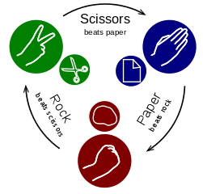

# [--- Day 2: Rock Paper Scissors ---](https://adventofcode.com/2022/day/2)

## Summary

Rock Paper Scissors is today's puzzle. This is something that I often use in Python class to teach if-elif-else concepts. The code for today's puzzle can be solved using the Java subset, it is just long and tedious. 

I think it is important for students to look at how they can extract parts of their code for reuse before starting on part 2. In this example the if statements to computer the score and value of each move is a separate method.

### Part 1 Algorithm

Loop over the input for each round
Split the moves into two strings
Compute the winner and award points for the round
Award points for the move played
Total all points for the result

### Part 2 Algorithm

Part 2 extends part 1 by requiring the programmer to compute the move that generates the outcome demanded in the strategy guide. This is yet another if statement.

## Alternate Solution
I have provided an alternate solution that demonstrates that RPS is actually a simple math problem.  I think it's very important to show that RPS looks like an if statement problem but can actually be solved with a simple math expression.



Note the circular nature of the RPS game. If we assign each position a value (rock=1, paper=2, scissors=3) we can see that it is easy for us to identify the outcome mathematically in many cases.

| P1       | P2       | Outcome | P2-P1 | +3 | %3 |
| -------- | -------- | ------- | ---: | ---: | ---: |
| Rock     | Rock     | Tie     |  0 | 3 | 0 |
| Rock     | Paper    | P2 Wins |  1 | 4 | 1 |
| Rock     | Scissors | P1 Wins |  2 | 5 | 2 |
| Paper    | Rock     | P1 Wins | -1 | 2 | 2 |
| Paper    | Paper    | Tie     |  0 | 3 | 0 |
| Paper    | Scissors | P2 Wins |  1 | 4 | 1 |
| Scissors | Rock     | P2 Wins | -2 | 1 | 1 |
| Scissors | Paper    | P1 Wins | -1 | 2 | 2 |
| Scissors | Scissors | Tie     |  0 | 3 | 0 |

We can see that we can compute the outcome with the formula
```outcome = (P2 - P1 + 3) % 3```

| outcome | result |
| ------: | ------ |
| 0       | Tie    |
| 1       | P2 Wins |
| 2       | P1 Wins |

This allows us to create a solution to Day 2 without a single if statement.

## Topics
1. Traversing a list
1. Splitting a string using indexOf and substring
1. Local methods (DRY)
1. String comparison
1. If statements, nested if statements and else if statements

## Deviations from the AP CSA Java Subset

No deviations from the Java subset were required for this solution. However, an alternate solution is provided that requires converting strings to numbers.

